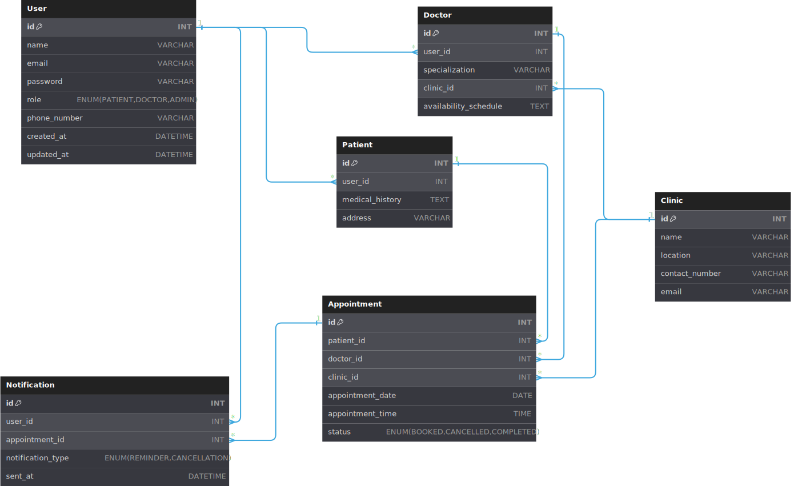

# Online Appointment Booking System for Medical Clinics

The project is an online appointment booking system for medical clinics,
built using Java Spring Boot. It will allow patients to schedule appointments
with healthcare providers, view available time slots, and receive reminders
while offering clinics tools for managing appointments efficiently.

The current version also includes:
- a visual dashboard at `/` for patient registration and appointment booking;
- automatic email reminders sent through Gmail SMTP when notification time is reached.

### Databese's Schema

Diagram containing the 6 entities and the relationships between them.
The entities are:

* User (shared by both Doctor and Patient)
* Doctor (extends User)
* Patient (extends User)
* Clinic
* Appointment
* Notification

Relationships include One-to-One, One-to-Many, and Many-to-One and Many-to-Many.



Entities and Relationships:

1. `User`
    - Generalizes all users (patients, doctors).
    - Has One-to-One relationships with Patient and Doctor.

2. `Doctor`
    - Extends users to include doctors.
    - Many-to-Many relationship with Clinic.

3. `Patient`
    - Extends users to include patients.
    - One-to-Many relationship with Appointment.
    - One-to-Many relationship with Notification.

4. `Clinic`
    - Represents clinics where doctors work.
    - Many-to-Many relationship with Doctor.

5. `Appointment`
    - Links patients, doctors, and clinics.
    - Relationships:
        - Many-to-One with Doctor.
        - Many-to-One with Patient.
        - Many-to-One with Clinic.
        - One-to-One with Notification.

6. `Notification`
    - Represents messages sent to users about appointments.
    - Relationships:
        - Many-to-One with Patient.
        - One-to-One with Appointment.

## 10 Business Requirements:

### 1. **Patient, Doctor, Clinic Management**

- **Requirement**: The system must allow patients to register, maintain personal profiles, and track their appointment
  and medical history.
- **Mapped Features**:
    - Registration and authentication (User Management System).
    - Medical history storage (Patient entity).
    - Appointment tracking (Appointment entity).

- **Requirement**: The system must support doctor registration with specializations and availability scheduling.
- **Mapped Features**:
    - Multi-clinic association (Doctor and Clinic entities).
    - Availability management (Doctor entity).

- **Requirement**: Clinics must be able to register, manage doctor rosters, and maintain contact information.
- **Mapped Features**:
    - Clinic profile management (Clinic entity).
    - Association with doctors (Many-to-Many relationship between Doctor and Clinic entities).

### 2. **Appointment Scheduling**

- **Requirement**: Patients must be able to book appointments with specific doctors at specified time slots, avoiding
  conflicts.
- **Mapped Features**:
    - Appointment creation and status tracking (Appointment entity).
    - Validation of doctor availability (Doctor entity).

### 3.**Notification System**

- **Requirement**: Notifications must inform patients about appointment confirmations, reminders, and cancellations.
- **Mapped Features**:
    - Notification entity linked to Appointment and Patient.
    - Automated notifications triggered on appointment status changes.

### 4.**User Authentication & Authorization**

- **Requirement**: The system must secure sensitive medical information and support role-based access control.
- **Mapped Features**:
    - User roles (Patient, Doctor, Admin).
    - Authentication and authorization (User entity).

### 5. **Availability Management**

- **Requirement**: The system must track doctor availability across clinics, handle scheduling conflicts, and support
  different appointment time slots.
- **Mapped Features**:
    - Availability schedules (Doctor entity).
    - Time slot validation (Appointment entity).
    - Conflict resolution logic (AppointmentService).

### 6. **Medical Records**

- **Requirement**: The system must maintain and secure patient medical records while allowing appropriate access.
- **Mapped Features**:
    - Medical history storage (Patient entity).
    - Access controls for sensitive data (User roles and permissions).
    - Secure storage and retrieval mechanisms (PatientService).

### 7. **Doctor Search and Clinic Filtering**

- **Requirement**: Users must be able to search for doctors by specialization and filter clinics by location.
- **Mapped Features**:
    - Search functionality (DoctorController).
    - Filtering clinics (ClinicController).

### 8. **Data Validation and Integrity**

- **Requirement**: All user inputs and system processes must adhere to validation rules and maintain data consistency.
- **Mapped Features**:
    - Input validation (DTO and model validation annotations).
    - Referential integrity in the database (JPA relationships).

### 9.**Doctor Transfer Management**

- **Requirement**: The system must allow doctors to be transferred between clinics.
- **Mapped Features**:
    - Modification of doctor-clinic associations (ClinicService).

### 10.**Patient Appointment Tracking for Discounts**

- **Requirement**: Clinics must be able to track the number of appointments per patient for discount purposes.
- **Mapped Features**:
    - Appointment tracking and count (AppointmentService).
    - Reporting for patient-specific metrics.

# 5 Main MVP Features

### 1. **User Management System**

- **Description**: Enables patients and doctors to register, authenticate, and manage their profiles.
- **Key Functionalities**:
    - User registration with role-based access control (Patient, Doctor).
    - Profile management (basic details like name, email, phone).
- **Implementation**:
    - `UserController`, `UserService`, `UserRepository` for managing CRUD operations.

### 2. **Clinic Management**

- **Description**: Allows registration and management of clinics, including their rosters of doctors.
- **Key Functionalities**:
    - Clinic profile creation (name, location, contact details).
    - Association with doctors (many-to-many relationship).
    - Retrieval of clinics by location.
- **Implementation**:
    - `ClinicController`, `ClinicService`, `ClinicRepository` for operations.

### 3. **Appointment Scheduling**

- **Description**: Enables patients to book and manage appointments with doctors at specific clinics.
- **Key Functionalities**:
    - Appointment creation with date, time, and doctor selection.
    - Appointment duration in minutes (e.g., 15/30/45/60).
    - Status tracking for appointments (e.g., Booked, Cancelled, Completed).
    - Prevention of scheduling conflicts through interval overlap checks.
- **Implementation**:
    - `AppointmentController`, `AppointmentService`, `AppointmentRepository` for handling logic.

### 4. **Doctor Management**

- **Description**: Facilitates doctor registration, specialization management, and availability scheduling.
- **Key Functionalities**:
    - Register doctors with specializations.
    - Associate doctors with multiple clinics.
    - Define and update availability schedules.
- **Implementation**:
    - `DoctorController`, `DoctorService`, `DoctorRepository` for CRUD operations.

### 5. **Notification System**

- **Description**: Sends automated notifications to patients for appointment confirmations, reminders, and
  cancellations.
- **Key Functionalities**:
    - Generate notifications upon appointment status updates.
    - Send reminders 24 hours before scheduled appointments.
    - Deliver reminder emails automatically with a scheduled background job.
- **Implementation**:
    - `NotificationController`, `NotificationService`, `NotificationRepository` to manage notifications.

### 6. **Visual Dashboard**

- **Description**: Provides a browser interface for rapid testing and demo flow.
- **Key Functionalities**:
    - Register patients with email address.
    - Create appointments using dropdown selections (patient/doctor/clinic).
    - Inspect reminder notifications and delivery status (Pending/Sent).
- **Implementation**:
    - Static frontend files in `src/main/resources/static/`.

# API Documentation for Online Appointment Booking System

## **Auth Controller**

| HTTP Method | Endpoint             | Description                                              |
|-------------|----------------------|----------------------------------------------------------|
| `POST`      | `/auth/patient/login`| Login for patient accounts and receive JWT.              |
| `POST`      | `/auth/doctor/login` | Login for doctor accounts and receive JWT.               |
| `POST`      | `/auth/login`        | Generic login (kept for compatibility).                 |

---

## **Patient Controller**

| HTTP Method | Endpoint                       | Description                        |
|-------------|--------------------------------|------------------------------------|
| `PUT`       | `/patients/updatePatient/{id}` | Update an existing patient by ID.  |
| `POST`      | `/patients/register`           | Register a new patient.            |
| `GET`       | `/patients`                    | Retrieve all patients.             |
| `GET`       | `/patients/{id}`               | Retrieve a specific patient by ID. |
| `DELETE`    | `/patients/{id}`               | Delete a patient by ID.            |

---

## **User Controller**

| HTTP Method | Endpoint          | Description                     |
|-------------|-------------------|---------------------------------|
| `POST`      | `/users/register` | Register a new user.            |
| `GET`       | `/users`          | Retrieve all users.             |
| `GET`       | `/users/{id}`     | Retrieve a specific user by ID. |
| `DELETE`    | `/users/{id}`     | Delete a user by ID.            |

---

## **Notification Controller**

| HTTP Method | Endpoint         | Description                 |
|-------------|------------------|-----------------------------|
| `GET`       | `/notifications` | Retrieve all notifications. |
| `POST`      | `/notifications` | Create a new notification.  |

---

## **Doctor Controller**

| HTTP Method | Endpoint                  | Description                           |
|-------------|---------------------------|---------------------------------------|
| `POST`      | `/doctors/register`       | Register a new doctor.                |
| `GET`       | `/doctors`                | Retrieve all doctors.                 |
| `GET`       | `/doctors/{id}`           | Retrieve a specific doctor by ID.     |
| `DELETE`    | `/doctors/{id}`           | Delete a doctor by ID.                |
| `GET`       | `/doctors/specialization` | Search for doctors by specialization. |

---

## **Clinic Controller**

| HTTP Method | Endpoint                                 | Description                                    |
|-------------|------------------------------------------|------------------------------------------------|
| `POST`      | `/clinics/{clinicId}/doctors/{doctorId}` | Associate a doctor with a clinic.              |
| `DELETE`    | `/clinics/{clinicId}/doctors/{doctorId}` | Remove a doctor from a clinic.                 |
| `POST`      | `/clinics/register`                      | Register a new clinic.                         |
| `GET`       | `/clinics`                               | Retrieve all clinics.                          |
| `GET`       | `/clinics/{id}`                          | Retrieve a specific clinic by ID.              |
| `DELETE`    | `/clinics/{id}`                          | Delete a clinic by ID.                         |
| `GET`       | `/clinics/{clinicId}/doctors`            | Retrieve all doctors associated with a clinic. |
| `GET`       | `/clinics/filterByLocation`              | Filter clinics by location.                    |
| `GET`       | `/clinics/email`                         | Retrieve clinic details by email.              |

---

## **Appointment Controller**

| HTTP Method | Endpoint                               | Description                               |
|-------------|----------------------------------------|-------------------------------------------|
| `GET`       | `/appointments`                        | Retrieve all appointments.                |
| `GET`       | `/appointments/mine`                   | Retrieve current user appointments.       |
| `POST`      | `/appointments`                        | Create a new appointment.                 |
| `GET`       | `/appointments/patients`               | Track appointments for specific patients. |
| `DELETE`    | `/appointments/{appointmentId}/cancel` | Cancel a specific appointment by ID.      |
| `DELETE`    | `/appointments/remove-cancelled`       | Remove all cancelled appointments.        |

---

- Use [Swagger UI](http://localhost:8080/swagger-ui.html) for detailed API exploration and testing.

## Visual Interface

- Open the dashboard at [http://localhost:8080/](http://localhost:8080/).
- On the landing page you can:
  - login as `PATIENT` or `DOCTOR`;
  - register a new `PATIENT` or `DOCTOR` account.
- After login, dashboard is role-specific:
  - `PATIENT`: profile, doctor list, create appointment, view/cancel own appointments;
  - `DOCTOR`: profile, own appointments, patient details for each appointment.

## Demo Seed Data (Optional)

Enable demo data with:

- `APP_SEED_DEMO_DATA=true`

This creates/updates:

- Clinics:
  - `Heart Care Central`
  - `City Medical Hub`
- Doctors:
  - `doctor.doe@demo.local` / password `Demo1234!`
  - `doctor.smith@demo.local` / password `Demo1234!`
- Patients:
  - `ana.popescu@demo.local` / password `Demo1234!`
  - `mihai.ionescu@demo.local` / password `Demo1234!`
- A few future appointments (non-overlapping).

Demo login details:

- Doctor login endpoint: `POST /auth/doctor/login`
- Patient login endpoint: `POST /auth/patient/login`
- Shared demo password for all demo accounts: `Demo1234!`
- Doctor demo emails:
  - `doctor.doe@demo.local`
  - `doctor.smith@demo.local`
- Patient demo emails:
  - `ana.popescu@demo.local`
  - `mihai.ionescu@demo.local`

Example login payload:

```json
{
  "email": "doctor.doe@demo.local",
  "password": "Demo1234!"
}
```

Overlap protection:

- The backend now rejects appointment creation if doctor already has an appointment at the same date+time.
- It also rejects if patient already has an appointment at the same date+time.

## Authentication (JWT)

- Public endpoints:
  - `POST /auth/patient/login`
  - `POST /auth/doctor/login`
  - `POST /doctors/register`
  - `GET /clinics`
  - `POST /clinics/register`
  - `POST /users/register`
  - `POST /patients/register`
- Protected endpoints:
  - all other API endpoints require `Authorization: Bearer <token>`.
- Role behavior for appointments:
  - `PATIENT`: can create and cancel only own appointments, can view `/appointments/mine`.
  - `DOCTOR`: can only view own appointments via `/appointments/mine`.
- Default token validity is 24h (`APP_JWT_EXPIRATION_MS`).

Environment variables:

| Variable | Description | Example |
|----------|-------------|---------|
| `APP_SECURITY_ENABLED` | Enables JWT auth layer | `true` |
| `APP_JWT_SECRET` | Base64 secret used to sign JWT | `...` |
| `APP_JWT_EXPIRATION_MS` | Token expiry in milliseconds | `86400000` |

## Receive Reminders (Email Notifications)

To actually receive reminder emails (not only DB records), configure Gmail SMTP and enable the notification worker.

1. Enable 2-Step Verification on the sender Gmail account, then create a Google App Password.
2. Set these environment variables before starting the app:

| Variable | Description | Example |
|----------|-------------|---------|
| `MAIL_USERNAME` | Gmail sender address | `myclinic@gmail.com` |
| `MAIL_PASSWORD` | Google App Password (16 chars) | `abcd efgh ijkl mnop` |
| `NOTIFICATION_EMAIL_ENABLED` | Enables scheduler-based email sending | `true` |
| `NOTIFICATION_EMAIL_FROM` | Optional explicit sender address | `myclinic@gmail.com` |
| `NOTIFICATION_SCHEDULER_DELAY_MS` | Optional polling interval | `60000` |

3. Register patient with a valid email address.
4. Create an appointment; the system creates a reminder notification at `appointment - 24h`.
5. Scheduler checks due notifications and sends emails automatically.

## Deploy on Render

The repository includes `render.yaml` for one-click blueprint deploy using Docker.

1. Push the project to GitHub.
2. In Render: `New +` -> `Blueprint` and select the repository.
3. Render reads `render.yaml`, builds `appointment_booking_system/Dockerfile`, and creates the web service.
4. In Render dashboard, set secret environment variables:
   - `DB_URL` (external MySQL JDBC URL)
   - `DB_USER`
   - `DB_PASSWORD`
   - `MAIL_USERNAME`
   - `MAIL_PASSWORD`
   - `APP_JWT_SECRET`
5. Trigger deploy and open your service URL.
6. Access dashboard at `https://<your-service>.onrender.com/` and Swagger at `/swagger-ui.html`.
